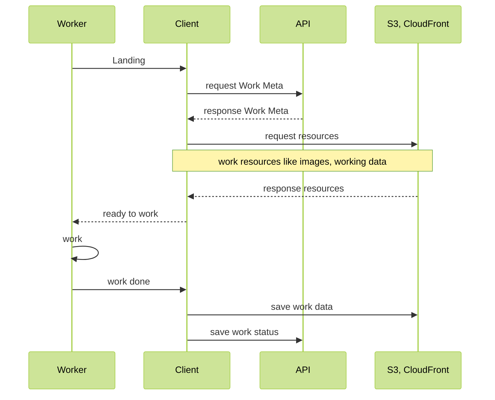

지난해 이직 후 옮긴 직장에서 가장 먼저 당면한 과제는 우리 플랫폼이 제공하는 업무용 작업 페이지의 랜딩 속도 개선과 랜딩 후 작업의 반응 속도를 개선하여 유저의 사용성을 개선시키는 것이었습니다. 작업 페이지의 속도 이슈는 일부 고객사들의 잠재적 불만사항 중 하나였고 일부 고객사는 이탈을 언급하기도 했나봅니다. Known-Issue 였다고는 하지만 고객사가 직접 언급을 하면서 발등에 불이 떨어졌습니다. (입사하자마자 당황스럽니다..) 글로벌 타겟으로 제공되는 플랫폼인지라 지역에 따른 체감 편차가 들쭉날쭉 했으며, 문제 제기를 한 고객사도 이 편차가 심한 지역을 주 지역으로 삼고 있었습니다. 과연 최선이었나? 라는 의문에는 자신있게 대답하긴 어렵지만, 어쨌거나 편차도 줄이고 그 외 잠재적 속도 개선도 시도했던 과정에 있던 고민과 실행 방안들에 대해 회고를 남겨봅니다.

가능하면 일반적인 인프라 용어를 사용하려 하지만, 우리 플랫폼은 AWS 위에 구축되어 있으므로 세부사항들은 특정 제품의 입장에서 서술될 것 같습니다만, 다른 클라우드 서비스라 할지라도 동일한  기능적 옵션들은 모두 제공될 것이라 예상합니다.

## 플랫폼 아키텍쳐

당시 우리 플랫폼의 대략적인 아키텍쳐와 정책과 플로우를 간단히 정리하면 다음과 같습니다.

- 글로벌 서포트를 위한 서울 / 버지니아 두 지역에 각각 서버군을 운영
- 각 서버군은 동일한 어플리케이션으로 운영되지만, 데이터는 각자 독립적으로 관리됨
- 고객사가 플랫폼에 가입하면, 가입 당시 접근 위치에 의해 가까운 곳으로 매핑된 서버군으로 배정
- 한번 서버군이 배정되면, 해당 고객사의 데이터는 모두 배정된 서버군에서 관리됨 (리소스 포함)
- 고객사 작업자의 작업용 리소스, 작업 결과  데이터는 객체 저장소 (S3) 에 저장됨

개인적으로 실체없이 뜬구름 속에서만 대략적으로 꿈꾸는(?) 글로벌 플랫폼의 이상적인 아키텍쳐라고 보기는 어렵지만, 논리적으로 보면 제법 합리적인 구조이기도 했습니다. 우선 비용 절감 문제야 어디라고 다르겠습니까만, 성장해나가는 스타트업으로써의 입장까지 감안하면 더더욱 괜찬은 구조라고 생각했습니다. 좋게 보자면 덕분에 의도치 않은 데이터 샤딩 효과를 자연스레(?) 얻을 수 있으니까요. 어쨌든 문제는 이 구조 상의 속도 이슈를 보완하는 것입니다.

## 생각보다 복잡한 관계와 지연의 원인

작업 페이지 속도 지연은 여러가지 단계에 걸쳐 나타나지만, 사용자 체감적으로 가장 큰 부분을 차지하는 것은 리소스 전달, 속도였습니다.

간단하게 접근해보면, 적당한 완충 지역을 선정해 서버군을 하나 정도 늘려는 것을 고려해볼 수 있을 겁니다. 살짝 더 생각을 해본다면, S3 를 쓰는 마당에 CloudFront (CDN) 를 적극 활용하면 되는 것 아닌가? 라는 생각이 듭니다. 당연하게도 이미 CDN 은 이미 사용 중이었습니다. 다만, 아쉽게도 작업 페이지의 속도에 큰 영향을 주는 이미지 / 데이터 전송에 CDN 의 도움을 사실상 받지 못하는, 아니 받지 못하는 것이 당연한 상황이었습니다. 고객의 유즈 케이스를 보탠 상황을 정리해보면 다음과 같습니다.

1. 동일한 고객사라 할 지라도, 실제 작업은 다양한 지역에서 이뤄진다.
  - 다양한 지역이라 함은 대륙을 넘나드는 차이를 보이기도 한다. (인건비)
2. 작업 리소스는 작업자들에게 고르게 개별 분배되며, 동일한 리소스를 여러 사람이 공유하며 사용하지 않는다.
  - 작업 / 승인의 단계를 거치며 작업자와 승인자 정도가 동일한 리소스로의 접근 빈도가 발생하지만, 이들마저도 대륙을 넘나드는 물리적 위치 차이가 날 수 있음. (그러기 쉬움)

위의 두가지 배경은 플랫폼 가입 당시 경로로 서버군의 지역이 배정되고 고정시키는 분리의 허점과 리소스 리로드부터 효과를 발휘하는 CDN 의 도움을 받을 수 없는 상황을 야기시키고 있었습니다. 상황을 도식화 하면 아래의 그림과 같습니다. 미국에서 아마도 관리자에 의해 가입된 고객사 A (보라색) 는 버지니아 서버군으로 배정을 받았지만, 실제 작업자들은 외주에 의해 전세계의 비교적 싼 인건비의 지역으로 퍼져있었고 이들은 위치에 따라선 아시아 대륙을 횡단하고도 대서양을 넘어야 하는 위치의 서버군과 통신을 할 수도 있습니다. 이런 유사한 케이스에 걸린 작업자들은 작업 페이지의 랜딩 / 반응 속도가 느릴 수밖에 없었습니다.

거기다 작업자들이 모두 한 지역에 몰려있다 하더라도 각자 접근하는 리소스가 다르다보니 CDN 은 항상 miss hit 케이스로 origin 서버에서 리소스를 가져다 전달했고, 어렵게(?) CDN 에 저장된 리소스는 빠르게 다시 로드되는 기회를 많이 얻지 못했습니다. 설령 기회를 얻는다 할지라도 이미 한번 리소스를 로드하는데 오랜 기다림을 얻었던 그 동일 작업자일 확률이 오히려 더 높고, 그는 이미 짜증이 났습니다.

## 리소스 전달을 위한 인프라 아키텍쳐 보완

가장 먼저 떠올린 방법은 CDN 의 지역별 캐시에 미리 리소스를 적재시키는 것이었습니다. 하지만 그런걸 지원해주는 CDN 을 찾기란 어려웠는데요. 그도 그럴 것이 CDN 은 수없이 많은 지역에 퍼져있는데, 이에 대한 프리로드 옵션을 지원한다는건 결국 그 많은 지역들의 스토리지 비용이 그대로 필요할 것이기에 지원할리가 없는 옵션인 셈이죠. 어플리케이션 개발 범위로만 보면, “레디스에 내가 미리 데이터 저장해놓지 뭐” 같은 느낌의 생각인데, 너무 쉽게 생각했습니다. 특별히 지정 관리되는 대용량 파일의 전세계 동시 배포를 지원하는 옵션은 AWS 를 비롯한 메이저 클라우드 업체들은 모두 지원합니다. 우리가 전달하려는 리소스는 산발적 다수의 저용량 리소스들이었기에 적합한 옵션은 아니었습니다.

### 물리적 방안이 확실하면서도 유일한(?) 해결, 저장소 복제 분산

어쨌거나 결론은, 언급된 조건들을 해결하는 방책으로 리소스 전달을 위한 물리적 거리 비용을 극복하기 위해선 사용자들과 가까운 곳에 리소스를 위치시킨다 였습니다. 캐시 프리로드로 접근한 것 역시 같은 맥락의 접근이었고, 결국 리소스 저장소의 위치를 좀 더 분산시킬 수밖에 없다고 판단했습니다. 방향은 정해졌지만, 이 방향 결정에는 두가지 부담이 있었습니다. 하나는 비용이고, 다른 하나는 속도 및 동시성으로 발생할 수 있는 이슈였습니다.

이전 아키텍쳐에서 서버군을 할당받은 고객사의 데이터 관리와 동작은 전적으로 해당 서버군을 통하는 원칙에서 리소스의 규칙은 격리 보관이 아닌 복제 보관으로 바뀝니다. 분산된 저장소의 지역이 2개가 늘어난다고 가정하면, 원래 2곳의 서버군 지역이은 원래 있었으나 2곳의 지역이 추가되었으므로 비용이 2배의  증가하는 것이 아닌, 각자 격리 관리하던 리소스를 모두 퍼트리는 것이 목적이므로 실제는 적어도 4배의 스토리지 비용과 부수적인 알파 비용이 더 붙게 됩니다. 비용적 측면의 부담 증가는 어쩔수 없는 영역임은 자명하고, 해결책 제안 시발점부터 수용성 검토 필요성을 재차 강조하며 컨펌을 받긴 했지만, 역시나 막상 실행하려면 부담되는 것은 어쩔 수가 없는 것 같습니다.

우선 순위가 명확한 사안이었으므로 빠른 적용을 고려하되, 늘어날 수밖에 없는 저장소 비용을 조금이라도 절감하고자 논의한 보완책은 다음과 같습니다.

- 아키텍쳐 변경 적용 이전의 데이터들은 분산시키지 않는다. (기존 데이터는 이미 완료된 작업물이므로 추가 비용을 씌우지 않음)
- 당장은 빠른 적용을 위해 옵션을 두지 않지만, 작업 속도 보장 지역에 대한 비용 부가 옵션 적용을 추후 검토한다.

### S3 지역간 복제 기능 좀 더 살펴보기

어쨌든 결정 및 실행까지 옮긴 사항이기도 해서 비용 이야기를 먼저 했지만, 저장소 복제 분산 의사 결정의 과정에서 선행되었던건 복제 방안 수립과 S3 지역 복제 기능 관련 테스트였습니다. 복제 행위 자체는 AWS S3 지역간 복제 기능이 제공되어 다행히 기능적 구현의 부담은 피하는듯 했지만, 문제는 AWS 가 제공하는 S3 지역 복제 기능이 어느정도의 복제 속도를 보여주는가와 요구 조건등을 살펴봐야 했습니다.

지역간 복제 기능을 사용하기 위해 스펙적으로 확인한 사항들은 다음과 같습니다.

- 객체 버전 관리 옵션을 필수적으로 사용해야 함
  - 버전 기능을 사용하지 않고 있었다면, 객체 버전 별로 저장량을 차지할테니 추가 비용 발생 여지가 생김
- 가이드 문서 상의 적당히 서술된 지역간 복제 지연은 속도 성능은 명확한 보장 기준치가 제시되지 않음
  - 복제 시간 제어 (S3 RTC) 라는 추가 옵션을 사용하면 99% 최대 15분내를 보장하며 (계약상 명시됨) 대게 수초 내 복사된다고 가이드 문서상 명시됨
- 지역간 데이터 전송 비용이 발생함
- 객체 수정도 복제 가능 ([Enabling replica modification sync](https://docs.aws.amazon.com/AmazonS3/latest/userguide/replication-for-metadata-changes.html#enabling-replication-for-metadata-changes))
- 삭제 상태도 복제 가능 ([Enabling delete marker replication](https://docs.aws.amazon.com/AmazonS3/latest/userguide/delete-marker-replication.html))

비용 문제는 앞서 많이 이야기 했지만, 뼈 아프게도 또 비용 관련된 부분이 있습니다. 앞서 이야기했던 +a 는 요기에 있습니다. 우리는 버전 관리 기능을 사용하고 있지 않았습니다만, 복제 기능의 사용을 위해선 어쩔 수 없이 기능을 켜야 했습니다. 버전 관리로 하나의 객체가 차지하는 용량 증가를 최소화 하기 위해선 [객체 생명주기 설정](https://docs.aws.amazon.com/AmazonS3/latest/userguide/object-lifecycle-mgmt.html)에서  과거 버전의 유지 시간을 적당히 설정해주는 것으로 그나마 조절 할 수 있습니다.

어쨌거나 복제 기능의 가장 중요한 이슈는 복제 속도와 이에 근간한 객체의 동시성 이슈였습니다. 작업 기반 리소스는 제공만 하는 입장이기에 상관이 없지만, 작업 결과 데이터는 저장을 하는 데이터입니다. 해서 전파가 얼마나 빨리되고, 동시에 여러 수정이 발생하면 어떤식으로 지역간의 복제가 이뤄지는가 에 대한 확인이 필요했습니다.

복제되는 속도는 RTC 옵션과는 무관하게 100kb 내외의 용량 기준 일반적으로 1~3초 에서 길게는 10초 정도의 시간이 발생했습니다. 적어도 약 몇백개의 테스트 케이스 중에 분단위를 넘어가는 케이스는 발생하지 않았습니다만, RTC 옵션을 켜도 보장 시간이 15분까지 명시되어있다는 것은 항상 염두에 둬야 합니다.

실제 지역간 복제 기능으로 객체들의 버전 관리 및 최종 형상이 어떻게 동작하는지 확인이 필요했고, 이를 위해 두가지 방법으로 테스트를 진행했습니다.

- 테스트 대상이 되는 버킷들 6곳 선정 (서울, 버지니아, 오레곤, 프랑크푸르트, 상파울로, 뭄바이)
- 동시 전송은 멀티 쓰레드 프로그래밍으로 최대한 race condition 이 발생하도록

#### 동시에 여러 지역에 객체 생성

- 선정된 서버 지역은 6곳이지만 이 테스트에서의 전송은 5곳의 지역으로 전송 (국가별로)
- 객체 키은 동일하게, 내용은 다르게. 내용은 간단하게 전송 대상이 된 서버군의 국가 or 지역 코드 텍스트
- 모든 지역의 마지막 객체 내용 (& 객체 버전) 은 모두 동일하게 마지막 싱크가 발생한 객체로 유지 됨
  - 객체의 메타 정보는 싱크를 발생시킨 (최초로 파일 업데이트를 처리한) 버킷에서 생성된 메타가 그대로 전파
- 프랑크푸르트 지역의 객체 이력을 보면, 이력 하나가 비어있음 → us
  - 동시에 다른 리전의 복제 싱크가 인입되어 하나의 싱크가 씹힌 것으로 보임
  - 테스트 전 이같은 스펙이 기재된 문서를 찾아서 봤던 기억이 있는데, 다시 찾으려니 찾을 수가 없음.. 어쨌거나 실현상으로 확인.

|  | 버전 메타 이력 | last | -1 | -2 | -3 | -4 |
| --- | --- | --- | --- | --- | --- | --- |
| 서울 | 파일 내용 | br | eu | us | in | kr |
| 버지니아 | 파일 내용 | br | eu | us | in | kr |
| 오레곤 | 파일 내용 | br | eu | us | in | kr |
| 프랑크푸르트 | 파일 내용 | br | eu | in | kr |  |
| 상파울로 | 파일 내용 | br | eu | us | in | kr |
| 뭄바이 (인도) | 파일 내용 | br | eu | us | in | kr |

#### 한 지역으로 같은 객체를 동시에 여러번 생성

- 서울 서버를 대상 9개의 객체 동시 생성 - 가장 빠른 네트워크 통신이 이뤄질 것이므로, race condition 기대치를 높이기 위해
- 위의 테스트와 유사하게. 객체 키는 동일하게, 각 객체의 내용은 1~8까지의 텍스트로 간단하게 구성
- 마찬가지로 서울에서 8개의 파일이 각 지역으로 동시에 퍼져나갔고, 모든 지역에 동일한 버전 이력 히스토리로 전파되었음

|  | 버전 메타 이력 | last | -1 | -2 | -3 | -4 | -5 | -6 | -7 | -8 |
| --- | --- | --- | --- | --- | --- | --- | --- | --- | --- | --- |
| 서울 | 파일 내용 | 8 | 1 | 2 | 4 | 6 | 7 | 9 | 3 | 5 |
| 버지니아 | 파일 내용 | 8 | 1 | 2 | 4 | 6 | 7 | 9 | 3 | 5 |
| 오레곤 | 파일 내용 | 8 | 1 | 2 | 4 | 6 | 7 | 9 | 3 | 5 |
| 프랑크푸르트 | 파일 내용 | 8 | 1 | 2 | 4 | 6 | 7 | 9 | 3 | 5 |
| 상파울로 | 파일 내용 | 8 | 1 | 2 | 4 | 6 | 7 | 9 | 3 | 5 |
| 뭄바이 (인도) | 파일 내용 | 8 | 1 | 2 | 4 | 6 | 7 | 9 | 3 | 5 |

두 테스트를 포함한 전반적인 테스트 확인 결과를 다시 요약해보면 다음과 같습니다.

- 지역 복제 기능은 동시 경쟁이 발생 시 최종적 일치는 보장된다.
- 단, 중간 상태는 간헐적으로 유실될 수 있다.
- 기본적으로 덮어쓰기이므로, 기존 값과의 병합을 지원하지 않는다.
- 복제 전파 속도는 파일 용량이 큰 것이 아니라면 수초 내에 일반적으로 이뤄진다.

위 결과들을 우리 플랫폼의 도메인 사례에 비춰 다음과 같은 이유들로 저장소 분산 적용은 당면한 페이지 속도 개선에 충분한 솔루션이 될 수 있다고 결론을 내렸습니다.

- 전파 시간의 보장에 민감한 것은 작업 결과 데이터이고, 용량을 아무리 크게 잡아도 00 MB 일 것이므로 대부분 수초 내에 전 지역으로 퍼질 것을 기대할 수 있음
- 무조건 덮어쓰기로 복제가 전파된다는 것은 개발 원론적으로 보면 크리티컬 이슈이지만,
  - 작업은 개별로 개개인에게 분배되는 구조를 가지므로 동시 작업이 발생할 일은 거의 없음. (만약 노션이나 구글 문서 같은 동시 작업이 일반적인 형태의 서비스였다면 애초에 받아들일 수 없는 제약사항이긴 합니다)
  - 동시 작업은 아니지만, 순차 작업이라고하면 작업 → 검수 단계가 필요한데, 전파 속도로 보면 이정도의 싱크 속도는 문제가 없을 것
  - 일반적이지 않지만, 동일 작업 대상의 동시 작업으로 인한 이슈가 발생할 시 작업 대상의 상태를 활용해 작업 대상 동시 접근을 block 시키는 후속 조치를 취할 것

S3 버킷 복제는 객체마다 개별로 복제될 버킷을 지정할 수 있습니다. 객체 키를 지정할 때 복제 대상 조건을 prefix 로 붙인 뒤 prefix 해석 조건을 복제 설정을 할 수 있고, 또 하나는 객체가 가질수 있는 custom 태그를 구성하여 태그 조건에 따라 복제 버킷을 지정할 수 있습니다. 객체의 키는 리소스가 제공될 때 너무 눈에 띄게 공개되기도 하고, 복잡성을 줄이기 위해서는 명시성이 떨어질 수 있으므로 우리는 객체 생성 시  `target_seoul : true`, `target_virginia : true` 와 같은 태그를 붙여 리소스 객체마다 복제될 버킷 대상을 달리 할 수 있게 설정했고, 이 태그는 앞서 잠깐 언급된 지역에 따른 비용 부가 옵션의 근간으로 활용하려 했습니다.

### 리소스 접근 라우팅

리소스의 물리적 저장소는 상대적으로 촘촘하게 퍼트렸지만, 실제 웹 페이지 속도 향상에 기여하기 위해선 지역에 따라 가까운 스토리지로 사용자를 접근시키기 위한 라우팅 전략이 필요합니다. AWS CloudFront 는 기본적으로 캐싱을 할 오리진 리소스 버킷을 명확히 지정해야 하고, 각 버킷은 지역 속성을 기본적으로 가지고 있습니다. 적절한 라우팅 전략을 찾아야 합니다.

#### 다중 리전 액세스 포인트 ([Multi Region Access Point](https://aws.amazon.com/ko/s3/features/multi-region-access-points/))

CloudFront 는 지역 동적  라우팅을 공식 기능적으로 지원하지 않지만, AWS 는 S3 하위의 추가 기능인 다중 리전 액세스 포인트란 상품으로 리소스로의 동적 라우팅을 제공합니다. MRAP 의 사용법은 매우 심플합니다. MRAP 라우터를 생성하며 라우팅할 버킷들을 연결 지정하면, 라우팅 ARN 이 생성되고, 이 ARN 을 기반으로 한 라우팅 도메인 ([`https://xxxx.mrap.accesspoint.s3-global.amazonaws.com`](https://maefjijergna7.mrap.accesspoint.s3-global.amazonaws.com/)) 으로 호출하면 라우터 정책에 의해 가장 가까운 버킷과 통신이 이뤄집니다.

MRAP 대시보드는 연결된 버킷들 중 연결은 유지하되, 당장의 라우팅 규칙에서 특정 버킷을 배제하는 운영 설정이 제공되며, 연결된 버킷간의 복제 규칙들에 대한 관리 기능도 제공합니다. 주의할 점은 MRAP 는 최초 생성 시 연결된 버킷 외의 버킷 추가나 제거는 불가능하다는 것 입니다. (라우팅 규칙에서 제외할 순 있지만) 연결 버킷의 구성을 변경하려면 새로운 MRAP 를 생성해야 하는데, 기본적으로 MRAP 는 라우터이고, 라우터에 연결되는 버킷들의 내부 설정은 변경되는 것이 아니기에 큰 부담은 아니지만, 라우팅으로 제공할 도메인을 새로운 MRAP ARN 을 기반으로 정확히 제공할 수 있도록 어플리케이션에서 잘 신경써줘야 합니다. 대다수의 회사들이 객체 접근 권한이나 시간 등에 제약을 둔 signed (or CloudFront persigned) URL 을 사용할텐데요. MRAP 역시 signed URL 을 생성할 수 있습니다.

MRAP 는 CDN 이 아닌 S3 라우터입니다. 이로 인해 객체 전달 속도가 CloudFront 에 캐싱 된 객체와 비교해보면 살짝 뒤떨어집니다. 또 이야기 할 것이 비용 문제인데, 우선 S3 나 CloudFront 대비 비쌉니다. MRAP 는 기본적으로 S3 에서 데이터를 전송하는 구조이므로 S3 비용을 기본으로 하고, 여기에  MRAP 라우팅 비용과 구간에 따라 가속 비용이 추가 부가됩니다. 대략 S3 전송 가격 기준 대비 1.2~1.3 의 비용이 발생할 것으로 계산이 되었습니다만, 케이스 바이 케이스의 요소가 많이 작용할 부분이므로 사용을 하려면 가격표를 기준으로 잘 계산한 뒤 사용 여부를 판단해야 합니다. ([S3 요금](https://aws.amazon.com/ko/s3/pricing/?nc1=h_ls))

#### 람다 엣지를 이용한 클라우드 프론트 라우팅 ([Lambda@Edge](https://docs.aws.amazon.com/ko_kr/lambda/latest/dg/lambda-edge.html))

MRAP 는 편리하지만 상대적 비용이 추가로 발생합니다. MRAP 부분에서 CloudFront 는 라우팅 기능을 기본적으로 제공하지 않는다 말씀드렸습니다만, Lambda 를 사용하면 CloudFront 에 코드로 커스텀 라우팅 기능을 덧붙일 수 있습니다.  람다 엣지를 활용하면 CF 로 인입되는 요청-응답 앞 뒤 과정 중 CF 동작에 영향을 주는 메타 활용, 조작하여 동작을 제어할 수 있습니다. 로직은 간단합니다. 요청을 받은 CF 의 위치에 따라 CF 가 데이터를 가져올 원본 S3 버킷을 판단해 조작하는 방법입니다.

CF 의 데이터 전송 가격은 S3 대비 저렴하므로 MRAP 의 데이터 전송 대비 비용 절감에 초점을 맞춘다면 더 적절한 선택일 것입니다. MRAP 의 라우팅 가격은 람다의 가격과 비교해서 퉁칠 수 있는 수준이 되지 않을까 싶습니다. (미비한 부분이라 생각해 제대로 계산해보진 않았습니다.) 다만 상대적 약점으로는 람다 인스턴스가 초기화 되는데 들어가는 시간이 들어간다는 것이고, 요청 시 초기화가 발생할 때마다 간헐적 차이는 있으나 테스트 결과로는 약 100ms ~ 200ms 소요되었습니다. 물론 리소스 당 접근 빈도에 비하면 AWS 지역 엣지의 접근 빈도는 비할수 없이 잦을 것이기에 큰 영향은 아닐 것으로 예상되지만, 어쨌거나 약간의 지연 요소가 있다는 것은 참고해야 합니다. 물론 MRAP 대비 운영 대응 접근성도 아무래도 떨어지긴 하겠죠.

이래저래 논의가 있었습니다만, 일단 우리는 빠른 적용을 위해 접근성이 좀 더 용이한 MRAP 로 라우팅 전략으로 선택했고, 이후 안정성을 모니터링하며 비용 절감을 위해 CF 람다 라우팅을 적용하기로 했습니다. 여담입니다만, 적용 후 언젠가 AWS SA 한분과 MRAP 사례에 대해 조언을 구했을 때 SA 분도 비용측면에서라도 람다 라우팅을 더 권장하셨고, AWS 내부 가속망의 성능도 CF 가 좀 더 좋을 것이라 언급해 주셨습니다. AWS 내부 가속망의 성능 부분은 어차피 MRAP 도 가속망을 타기에 (가속망 비용까지 받아가는 마당에) 조금 의아했지만 CF 가 가속망을 타는 로직이 좀 더 잘 구현되어 있는것인가? 정도로 이해했습니다. 이부분은 제가 SA 분의 조언을 제대로 이해하지 못했을 수도 있는 어디까지나 여담이므로 그런 이야기가 있더라.. 정도로 이해해주시면 좋을 것 같습니다.

## API 통신 속도 상승을 위한 편법

리소스 저장소 분산과 라우팅을 적용해 리소스 전달 속도나 저장 속도는 테스트 결과 상으로 분명 의미 있는 상승을 이뤘습니다. 리소스는 분산 지점을 늘렸으니 세계 곳곳에 불규칙하게 퍼진 사용자들과의 물리적 거리를 좁힌 결과가 나타난 것이지만, API 서버는 여전히 두 곳의 지역에 한정 배치되어 있고, 이는 사용자들의 물리적 거리는 경우에 따라 꽤 먼 거리가 될 수 있습니다. 우리 플랫폼은 이미 Cloud Front 를 API 앞단에 배치해 AWS 가속 네트워크를 사용하고 있었기에, 시스템 아키텍쳐 전반적인 재조정을 동반하지 않는 한, 당장 API 통신의 속도 문제를 크게 제어하긴 어려웠습니다.

해서 한가지 편법을 사용하기로 합니다. 기본적으로 우리가 제공하는 API 들은 CORS 정책을 모두 열어놓고 있었습니다. 다만 우리 플랫폼은 웹 페이지이므로, 대부분의 API 요청은 브라우저에 의해 preflight 요청을 한번씩은 거치게 되어 있습니다. 물리적으로 먼 거리의 통신을 CORS 허용 여부를 확인 하기 위해 한번의 래핑 요청이 발생하게 되어 있으니, 서버와 클라이언트간의 거리가 멀어 2초의 통신이 발생하는 작업자의 경우 실제론 4초의 통신 시간을 경험하게 됩니다. 해서 이 hanshaking 구간의 시간을 줄이기 위해 API 에 연결된 CF 에  [Cloud Front Function](https://aws.amazon.com/ko/blogs/korea/introducing-cloudfront-functions-run-your-code-at-the-edge-with-low-latency-at-any-scale/) 에 람다를 붙여 preflight 요청만이라도 빠르게 완료되도록 설정했습니다. (CORS 를 모두 열어두는게 맞느냐에 대한 다른 관점의 의문은 일단 회피하겠습니다…)

### Lambda@Edge 와 CloundFront Function

CF Function 과 Lambda@Edge 는 유사하게 CF 요청 인입을 제어하는 관점 제어 방안입니다만, 약간의 차이가 있습니다. 위 그림과 같이 CF 는 엣지 와 지역 엣지로 크게 구분되는데, 실제 원본에과의 연동 및 제어를 하는 구간은 지역 엣지 이고, 엣지는 그 앞단의 일반적인 캐싱 데이터만 존재하는 레이어 라고 간단하게 구분할 수 있을 겁니다. 해서 실제 동작의 시점이 다르고 관점 캐치에 제공되는 이벤트의 구조도 당연히 다릅니다. CORS 정책 허용 정보는 어차피 모두 허용 값으로 리턴이라는 간단한 로직이고, 당연히 빨리 응답할수록 의도에 부합하므로 네트워크 단계를 조금이라도 줄이는 CF Function 이 더 타당합니다. 실행 시간도 가격 비용도 Lambda@Edge 에 비해 상대적으로 훨씬 저렴합니다.

람다@엣지 의 함수들은 람다 메뉴를 통해 관리되지만, CF 함수의 함수들은 CF 메뉴 하위의 함수 메뉴에서 별도로 관리됩니다.  (관리 중 자주 헷갈리는 부분)

- [Lambda@Edge 이벤트 구조](https://docs.aws.amazon.com/AmazonCloudFront/latest/DeveloperGuide/lambda-event-structure.html)
- [CloudFront Function 이벤트 구조](https://docs.aws.amazon.com/AmazonCloudFront/latest/DeveloperGuide/functions-event-structure.html)

## 어플리케이션 레이어에서의 소소한 추가 사항

인프라 아키텍쳐의 보완은 우선 위에서 취한 조치 사항들로 대응을 했고, 어플리케이션 레이어에서 뭔가 더 보완할 부분은 없나 살펴보았습니다. 우리는 리소스를 실제로 적재 / 저장 할 signed - presigned URL 메타를 API 로 전달하고 있었습니다. 여기서 보완할 부분이 하나 보였는데, URL 을 매번 새롭게 sign, presign 해서 전달을 하고 있었다는 것 입니다.

sign, presign 을 매번 한다는 것은 동일한 동작을 요청을 받을때마다 수행한다는 것도 문제지만, 실제 페이지 사용자의 경험적으로 문제가 되는건 적재할 리소스는 실제론 동일한 리소스임에도 불구하고 매번 URL 이 변경되어 클라이언트에게 전달되는 이유로 브라우저의 캐싱 지원을 받을 수 없었고 매번 네트워크로 리소스를 접근하도록 동작한다는 점입니다.

이는 사용자 경험 측면에서도 인프라 네트워크 전송 비용 측면에서도 일종의 누수 지점이라고 볼 수 있었고, 이를 개선하기 위해 한번 생성된 URL 은 캐싱을 하고, 캐싱 시간 동안은 사용자가 동일 리소스를 다시 접근할 경우엔 브라우저 캐싱의 지원을 받을 수 있도록 수정했습니다. 인프라 아키텍쳐를 변경하면서 가격 비용에 대한 부담이 많이 증가할 수밖에 없었는데, 이 조치로 약간의 위안을 삼을 수 있어 개인적으로는 참 다행이었습니다. (실제로 동일 리소스 재접근 시나리오는 그리 빈번하지 않을 것이라는건 알고 있습니다만.. )

## 결론
결과적으로 위 조치사항들을 적용한 뒤 글로벌 작업 페이지의 속도는 전방위적으로 꽤 개선되었고 실제 고객에게도 만족스러운 속도 개선을 체감한다는 피드백을 받을 수 있었습니다. 머리속으로 가격 비용이 늘어난건 어쩔 수 없다고 이해하고 있습니다만, 마음 한편엔 이게 최선이었을까? 의문과 아쉬움이 남는 것도 사실입니다. 글은 굉장히 길어졌지만 요약해보면, 결국 상식적인 당연한 조치들을 비용 증대를 감당하며 취했다.. 라고 볼 수 있는지라  제가 미처 인지하지 못한 더 좋은 방법에 대한 욕구가 큽니다.
부족한 면이 분명 있을 법 하지만 한가지 사례로 봐주시면 좋을 것 같고, 혹시 작은 부분에서 조금이라도 개선을 시도해볼만한 부분이나, 장기적으로 시스템 아키텍쳐의 구조 변경에 참고해볼만한 조그만 점이라도 있다면 거침없이 의견 주시면 감사하겠습니다.

